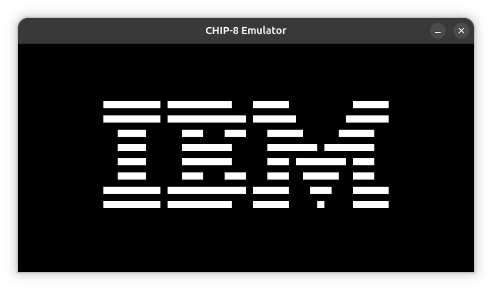
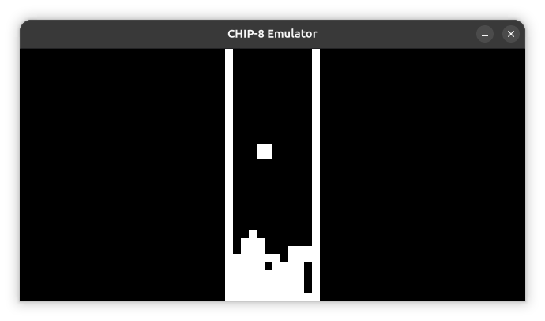
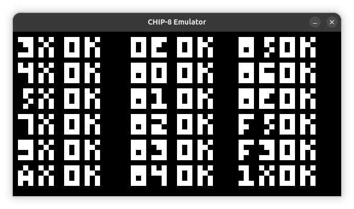

#### Author
Eva B.

# CHIP-8 Emulator

A CHIP-8 emulator written in C using SDL2.

This project is a CHIP_8 emulator written in pure C as a learning project. It implements the complete CHIP-8 instruction set, graphical output using SDL2, keyboard input, sound generation and a custom unit testing framework.


[](https://evareid12.github.io/chip8-emulator/)

## Screenshots







## Features
- [x] Complete CHIP-8 instruction set implemented
- [x] Graphical output using SDL2
- [x] Keyboard input
- [x] Sound generation
- [x] Custom unit testing framework

## Build
To build the emulator, you need to have SDL2 installed on your system. After that, you can build the project using CMake.

```
mkdir build
cd build
cmake ..
make
```

## Usage
To run the emulator, use the following command:

```
./chip8-emulator <path_to_rom>
```

## Controls

| PC | CHIP-8 |
|:----:|:----------:|
| 1 | 1 |
| 2 | 2 |
| 3 | 3 |
| 4 | C |
| Q | 4 |
| W | 5 |
| E | 6 |
| R | D |
| A | 7 |
| S | 8 |
| D | 9 |
| F | E |
| Z | A |
| X | 0 |
| C | B |
| V | F |

## Project Structure

src/ - Contains the source code for the emulator
include/ - Contains the header files for the emulator
tests/ - Contains the unit tests for the emulator
roms/ - Contains the CHIP-8 ROMs used for testing
assets/ - Contains the assets used for the README and screenshots

## Architecture

The emulator is structured into several modules, each responsible for a specific aspect of the CHIP-8 system:

- **chip8** - This module contains the core logic of the CHIP-8 emulator, including the implementation of the instruction set, memory management, and CPU cycle handling.

- **instructions** - This module contains the implementation of each CHIP-8 instruction. Each instruction is implemented as a separate function, which is called by the CPU cycle handler in the chip8 module.

- **sdl_display** - This module handles the graphical output of the emulator using SDL2. It is responsible for rendering the CHIP-8 display to the screen.

- **timer** - This module manages the delay and sound timers of the CHIP-8 system. It updates the timers at a fixed rate and triggers sound generation when the sound timer is active.

- **audio** - This module handles sound generation using SDL2. It generates a beep sound when the sound timer is active.

- **keyboard** - This module handles keyboard input for the emulator. It maps the CHIP-8 keypad to the host system's keyboard and updates the state of the keys accordingly.

## Running Tests

To run the unit tests, use the following command after building the project:

```
./tests
```

## References

- [CHIP-8 Wikipedia](https://en.wikipedia.org/wiki/CHIP-8)

- [Guide to making a CHIP-8 emulator](https://tobiasvl.github.io/blog/write-a-chip-8-emulator/)

- [Cowgod's CHIP-8 Technical Reference](http://devernay.free.fr/hacks/chip8/C8TECH10.HTM)

## License
GPL-3.0 License